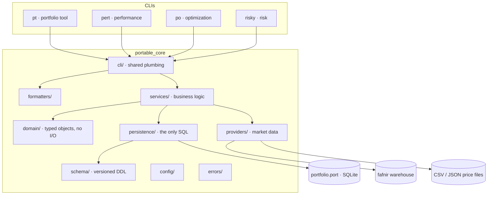

# Architecture

How `portable` is put together, why, and how to add to it without breaking the
invariants in [`CLAUDE.md`](../CLAUDE.md).

---

## 1. The shape of the thing

`portable` is one framework and several thin CLIs.

**The dependency rule, in one line:** arrows point inward and down. `domain/`
depends on nothing but the standard library. Nothing depends on a CLI.

| Layer | May import | May **not** import |
|---|---|---|
| `domain/` | stdlib, `errors/` | anything else in core |
| `services/` | `domain/`, `persistence/`, `providers/`, `errors/` | `formatters/`, `cli/` |
| `persistence/` | `domain/`, `schema/`, `errors/` | `services/`, `providers/`, `cli/` |
| `providers/` | `domain/`, `config/`, `errors/` | `services/`, `persistence/`, `cli/` |
| `formatters/` | `domain/`, `errors/` | `services/`, `persistence/`, `providers/` |
| `cli/` | everything in core | any other CLI package |

`tests/unit/test_layering.py` enforces this by walking the import graph. It also
enforces the two placement rules that matter most:

- **SQL appears only in `persistence/` and `schema/`.** (ADR 0002)
- **Nothing fafnir-shaped appears outside `providers/fafnir.py`.** (ADR 0006)

**No CLI imports another CLI.** If `pert` and `po` would need the same code, that
code belongs in `portable_core`. This is not a style preference: it is what keeps
each tool standalone, and it is tested.

---

## 2. Where a command's control flow goes

A representative path — `pt sell AAPL --qty 50 --price 190.00 --date 2026-03-14`:

1. **`portable_pt/commands/trade.py`** — Typer parses. Nothing else happens here.
   The CLI layer's entire job is: parse, resolve global flags, call one service,
   hand the result to a formatter, choose an exit code.
2. **`portable_core/cli/context.py`** — resolves the layered configuration
   (§6), opens the `.port` file, and builds a `CommandContext` carrying the
   connection, the effective config, the `as_of` date, and the output format.
3. **`services/trading.py`** — the business logic. Validates that the account
   exists and is open, resolves the instrument, asks `PositionEngine` which
   position this trade belongs to, asks `LotEngine` which lots the sale
   consumes under the relief method in force, computes proceeds and realized
   gain, and asks `TaxEngine` for the estimated liability.
4. **`persistence/`** — one transaction: append the ledger row, write the derived
   `lot_disposition`, `realized_gain`, and updated `lot`/`position`/`cash_balance`
   rows. All or nothing.
5. **`formatters/`** — renders per `--format`. Number presentation rules live
   here and nowhere else.

**`--dry-run` cuts between 3 and 4.** The service computes the full effect and
returns it; persistence is never called. This is why the effect of a dry run is
exactly the effect of the real run — it is the same code path with the write
suppressed, not a separate estimate.

---

## 3. The `.port` file

One SQLite database per portfolio. Opened with `foreign_keys=ON`,
`journal_mode=WAL`, `synchronous=FULL`. Full column documentation is generated
from DDL comments into [`schema.md`](schema.md); the format contract is
[`port-format.md`](port-format.md).

Four classes of table, and the distinction drives everything (ADR 0010):

| Class | Mutability | Rebuilt by `pt rebuild`? |
|---|---|---|
| **Ledger** — `transaction` | Append-only, enforced by trigger | Never touched |
| **Reference** — instruments, prices, corporate actions | Immutable once written | Never touched |
| **Config** — accounts, tax rates, benchmarks, policies | Effective-dated, immutable once effective | Never touched |
| **Derived** — positions, legs, lots, dispositions, balances, snapshots | Materialized for speed | **Dropped and rebuilt** |

Money, quantities, prices, and rates are canonical decimal `TEXT` (ADR 0005).
There is no `REAL` column in the schema and a test asserts it.

---

## 4. Services — where the business logic lives

Each engine is a class with no I/O of its own; it is handed repositories and
returns domain objects. This is what makes them unit-testable without a database.

| Engine | Owns |
|---|---|
| `LotEngine` | Lot creation, relief-method matching (spec-ID, FIFO, LIFO, HIFO, LOFO, average cost), disposition, holding-period determination |
| `PositionEngine` | Position and leg lifecycle: open, add, reduce, roll, close, group, ungroup; the long↔short flip split |
| `TaxEngine` | Estimated liability from realized gains and effective-dated rate schedules (ADR 0011) |
| `ValuationEngine` | Snapshots: beginning/ending market value, accrued income, cash, margin, external flows with day-resolution timing, and the price set consumed |
| `CorporateActionEngine` | Splits, reverse splits, stock dividends, spinoffs, mergers, symbol changes, delistings — and their basis and holding-period effects |
| `CashFlowClassifier` | **One function.** `classify(txn, level)` (ADR 0007, `PORT-GIPS-B02`) |
| `DisclosureEngine` | Ordered, stable-ID disclosure items **generated from state**, not from a template |
| `ReplayEngine` | Drops derived state and rebuilds it from the ledger in ledger order |

### The two engines worth reading before you touch anything

**`CashFlowClassifier`** is a single total function over transaction type and
level. It is the highest-risk code in the repository, because getting it wrong
produces a return that is arithmetically defensible and economically
meaningless. `docs/gips-standard.md` `PORT-GIPS-B02` carries the matrix; the test
carries it verbatim. No call site re-derives it.

**`ReplayEngine`** is the audit. If replaying the ledger does not reproduce
materialized state, something is wrong and `pt validate` says so. Every piece of
derived state must be reachable by replay, or it is not derived state — it is
data with no source of truth, which this architecture does not have a place for.

---

## 5. Market data

An abstract `MarketDataProvider` with capabilities as **separately declarable
protocols**, so a partial provider is legal and its gaps are visible:

`SecurityMasterCapability` · `EndOfDayPriceCapability` · `IntradayPriceCapability`
· `CorporateActionCapability` · `DividendCapability` · `BenchmarkCapability` ·
`RiskFreeRateCapability` · `FxCapability` (interface only in v0.1)

Three implementations ship:

- **`FafnirProvider`** — the primary. Direct SQL against the warehouse's
  `core.*` and `ref.*`; `duk` for the treasury curve. **Unadjusted prices only**
  (`PORT-GIPS-A01`). It deliberately declares **no** `BenchmarkCapability`,
  because fafnir carries no total-return index series and `PORT-GIPS-G01`
  requires refusal rather than approximation. See ADR 0006 — that finding is the
  single most important thing in it.
- **`FileProvider`** — local CSV/JSON with a documented schema. A first-class
  citizen, not a test double: it is how benchmarks get in, how the repo is
  testable offline, and how the examples run with no warehouse.
- **`NullProvider`** — declares nothing and refuses politely, so a command that
  needs a price fails with a good message rather than an `ImportError`.

Every price is cached into the `.port` file with its **source, as-of timestamp,
valuation level, and estimate flag**, and every valuation snapshot records the
exact set of price rows it consumed. That is not convenience — it is what
`PORT-GIPS-J03` requires and what makes a return traceable to the ticks that
produced it. `--offline` forces cache-only operation; a price stale beyond
tolerance is exit code 5, never a silent substitution.

---

## 6. Configuration

Layered, highest precedence first:

1. command-line flags
2. environment variables (`PORTABLE_*`)
3. project config (`./portable.toml`)
4. user config (`~/.portablerc`, TOML)
5. built-in defaults

`portable config show --format json` prints the effective configuration **and
where each value came from**. Secrets are never read from a config file when an
environment variable is available, and are never logged.

**What is deliberately *not* configuration:** the large-cash-flow and materiality
thresholds. Those are effective-dated rows in the `.port` file (`return_policy`),
because they must be reconstructible for historical periods — a threshold that
lived in a config file could not be recovered for a period that ended two years
ago. `PORT-GIPS-B03` and `E09`. Same reasoning as tax rates.

---

## 7. Output

One formatter subsystem, four formats, used by every CLI:

- **`json`** — schema-stable and versioned, validated against `schemas/` in CI.
  `Decimal` serializes as a **string**, never a float. The envelope carries
  `{schema_version, command, generated_at, as_of, portfolio, data, warnings,
  disclaimer}`.
- **`csv`** — RFC 4180, one logical table per invocation, full precision.
- **`markdown`** — GFM tables, for pasting into notes or an LLM context window.
- **`table`** — Rich, colour-aware, degrades to plain text on a non-TTY or under
  `NO_COLOR`.

Two return-specific rules live in the formatter **so that no call site can bypass
them**:

1. A return for a period shorter than one year is **never annualized**
   (`PORT-GIPS-B07`). The return object carries its period length; attempting to
   render an annualized figure for a sub-year period raises.
2. Every rendered return carries its **method, basis, and period**
   (`PORT-GIPS-H04`).

The `disclaimer` is an envelope **field** in JSON, not a rendered string, so a
consumer cannot drop it without noticing.

---

## 8. Errors and exit codes

One hierarchy rooted at `PortableError`, each with a stable code
(`PT-E-LOT-UNMATCHED`), a human message, and structured context. Errors render as
JSON when `--format json` is active. No bare exception reaches the user.

| Exit | Meaning |
|---|---|
| `0` | success |
| `1` | generic error |
| `2` | usage error |
| `3` | portfolio/file error (missing, locked, wrong schema version) |
| `4` | validation failure (invariant broken, unmatched lots, missing return policy) |
| `5` | data unavailable (provider down, price stale beyond tolerance) |
| `6` | reconciliation break |

The `PT-E-GIPS-*` prefix is reserved for refusals the performance standard
requires — at minimum `PT-E-GIPS-NO-FLOW-POLICY` and
`PT-E-GIPS-PRICE-ONLY-BENCHMARK`.

---

## 9. Adding a module

### A new service

1. Put it in `services/`. Not in a CLI module, not in a repository.
2. Take repositories as constructor arguments; do no I/O of your own.
3. Return domain objects. If you need a price, be handed one.
4. If it writes derived state, add it to `ReplayEngine` **and** to
   `tests/property/test_replay_reproduces_state.py` **in the same commit**.
   `CLAUDE.md` invariant 3.
5. If it touches valuation, cash flows, or returns, cite the `PORT-GIPS-xxx`
   requirement in the code comment and in the test name, and link the test name
   back into that requirement's **Test** line in `docs/gips-standard.md`.

### A new command

1. `pt <noun> <verb>`. Register it through `portable_core/cli/registry.py` so it
   appears in `pt introspect` automatically.
2. Support the global flags: `--format`, `--as-of`, `--source`, `--offline`,
   `-v/-vv`, `--quiet`, `--no-color`. If it mutates, also `--dry-run` and
   `--yes`.
3. Anything that could prompt must have a flag that supplies the answer.
   Non-interactive operation is a requirement, not a nicety.
4. If it emits `--format json`, publish a JSON Schema under `schemas/` and add it
   to the schema validation test.

### A schema change

1. New numbered file in `portable_core/schema/`, never an edit to an applied one.
2. Idempotent. Tested in both directions where reversible.
3. Bump `schema_version`; add a `CHANGELOG.md` entry.
4. Regenerate `docs/schema.md` (`make docs`).
5. Money/quantity/price/rate columns are `TEXT` with a `-- decimal` comment.
6. Check in at the phase boundary before you write it. Schema changes are the
   expensive ones to get wrong.

---

## 10. C++

The toolchain is CMake + pybind11 + Catch2 via `scikit-build-core`, matching
[`po`](https://github.com/rtrimble13/po)'s conventions (C++17, CMake ≥ 3.20,
`FetchContent` with shallow clones, `PORTABLE_BUILD_*` option flags) so that
integrating `portopt` in v0.3 is a merge rather than a rewrite.

**v0.1 ships scaffolding only.** `portable_native.probe()` proves the toolchain
end to end — importable after `pip install -e .`, tested from both pytest and
Catch2, built in CI on Linux and Windows. There is no production C++ yet, by
design.

### The fallback contract — read this before writing any C++

**Every C++ path keeps a pure-Python reference implementation and a differential
test comparing them. No exceptions.** That fallback is how we know the fast path
is right.

- The Python reference is written **first** and is **normative**. If the two
  disagree, the C++ is wrong until proven otherwise.
- `portable_core/native/__init__.py` is the only dispatch point and exposes
  `HAVE_NATIVE` and `implementation()`.
- The differential test is **skipped loudly** when the extension is absent — it
  prints which functions went unverified rather than passing quietly.
- **No native-only functionality.** The extension may only make existing Python
  faster. `PORTABLE_BUILD_NATIVE=OFF` must be a complete, correct product.
- **`Decimal` does not cross the pybind11 boundary.** When a money hot path is
  eventually moved, it moves as integer or string arithmetic with an explicit,
  tested conversion — never as `double`. Invariant 1 does not stop at the
  language boundary.

ADR 0008 has the full reasoning. `docs/roadmap.md` has the candidate hot paths;
profile before you pick one.

---

## 11. Agentic and MCP readiness

The hooks are built; the server is backlog.

- **`pt introspect --format json`** emits the complete command tree — commands,
  arguments, types, defaults, help text, and output schema references —
  sufficient for a generator to produce MCP tool definitions without parsing
  `--help`.
- **`schemas/`** carries a versioned JSON Schema per command output, validated in
  CI against real command output.
- **Every command is non-interactive-capable**, and `--dry-run` on every mutating
  command prints the exact effects that would occur.

This is what makes MCP integration a wrapper rather than a rewrite.
