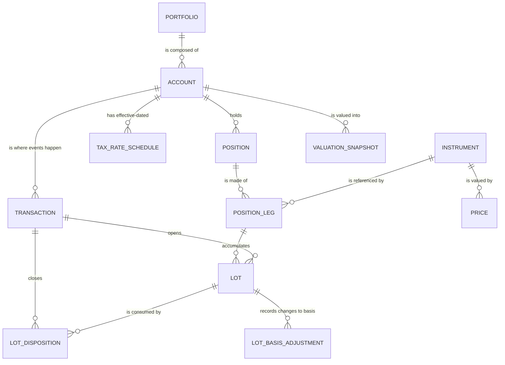

# The domain model

Written for a portfolio manager, not a programmer. If you know what a covered
call is and what "spec-ID" means, you can read this; you do not need to read any
code.

The technical rendering of the same thing is [`schema.md`](schema.md) (generated
from the DDL) and [`architecture.md`](architecture.md).

---

## The one-paragraph version

A **portfolio** is a file. It contains **accounts**. Accounts hold **positions**,
and a position can span more than one security — a covered call is one position,
not two. Every position is made of **lots**, which are what the tax code actually
cares about. Nothing in the file is true because somebody typed it into a
summary: everything is derived from an append-only list of **transactions**, and
the system can rebuild the whole picture from that list at any moment. That
property is the reason to trust the numbers.

---

## The picture

---

## Portfolio

**One `.port` file. Everything needed for analysis is inside it** — accounts,
instruments, transactions, lots, prices, valuations, benchmarks, and metadata.
Hand somebody the file and they have the whole book of record.

A portfolio has a name, an inception date, a base currency (USD only in v0.1,
though the currency travels on every row so multi-currency is an extension rather
than a migration nightmare), a fiscal year end (calendar by default), and a
schema version.

> **In GIPS terms a portfolio is a *total fund*.** `portable` follows the Asset
> Owner regime, where the reporting unit is the total fund rather than a
> composite. `docs/gips-standard.md` §4.4 argues why. This matters more than it
> sounds: it is why the minimum track record is one year rather than five, why
> composites are optional, and why there is no internal-dispersion requirement.

---

## Account

**Accounts hold positions and cash, and every transaction happens in an
account.** A portfolio of three accounts at two custodians is the normal case,
not an edge case.

An account carries:

- **Tax treatment** — `taxable`, `tax_deferred`, or `tax_exempt`. This is a
  first-class attribute, not a tag, because it changes what a realized gain
  means.
- **Effective-dated tax rates**, stored as **separate federal, state, and NIIT
  components** so that the effective rate is explainable rather than a magic
  number. Effective-dated so that a rate change next year does not retroactively
  restate what last year's sale cost you.
- **A cash balance**, and optionally a sweep or money-market instrument.
- **A margin loan balance**, when the account has one. This is a modelled
  liability, not a memo: market value is assets *minus* the loan, and margin
  interest reduces return.
- **A default relief method** — how closing trades pick lots, overridable per
  trade.
- **`cash_treatment`** — `invested` or `operating`. Invested cash is always in
  the return. Operating cash not available for investment may be excluded, but
  only by an explicit stored flag, never implicitly.
- Custodian, an account number alias (never the real number), open/closed status.

**Accounts track P&L net of tax.** Positions do not — see below. That split is
deliberate, and it is the reason the model has both.

---

## Instrument

The security master, local to the file, hydrated from the market data provider
and cached. Supported in v0.1:

- **Equity, ETF, mutual fund, ADR** — long and short
- **Cash and money market**
- **Listed options** — underlier, right, strike, expiry, **multiplier stored not
  assumed** (it is 100 until the day it isn't, and that day costs you 100×),
  OCC-style symbol, exercise style
- **Fixed income** — issuer, coupon, coupon frequency, maturity, day-count
  convention (30/360, ACT/ACT, ACT/365, ACT/360), face, accrual basis, callable

Identifiers resolve in a documented order: internal id, then CUSIP/ISIN/FIGI,
then **the ticker as it stood on the relevant date** — not the ticker today.
Symbol history is kept, because a rename or a relist silently rewrites history
otherwise.

---

## Position

**A holding — and a position may span multiple instruments.** This is the part
most systems get wrong.

A vertical spread is one position across two options. A covered call is one
position across a stock and a short call. A collar is one position across three
instruments. If you model each leg as its own position, you cannot answer "what
did this collar earn me" without writing the query yourself, and the assignment
path — where the call premium has to flow into the stock's proceeds — becomes a
fix-up that reaches across positions. That is where these bugs live.

So:

- **`position`** is the container and the unit of *trader intent*: account,
  strategy type (`single`, `covered_call`, `vertical`, `calendar`, `collar`,
  `custom`), open date, close date, status.
- **`position_leg`** binds an instrument to the position with a **role**
  (`underlying`, `short_call`, `long_put`, …) and a sign (+1 long, −1 short). The
  role is what lets the system know that *this* short call is written against
  *that* stock.
- **Lots hang off legs**, not off positions — a lot must resolve to exactly one
  instrument, and a position does not.

**Positions track P&L independent of tax.** Tax is an account-level concern. The
tax engine never reads a position; it reads dispositions. That keeps the two
questions — "how did this trade do?" and "what do I owe on it?" — from
contaminating each other.

A position exposes realized P&L, unrealized P&L, and total return contribution.
Strategy-level greeks and max-gain/max-loss are backlog; the interface is left
for them.

**Positions can be regrouped.** When you write a call against stock you already
own, your intent changes: two positions become one covered call. `pt position
group` moves the legs. Because lots hang off legs and legs carry the position id,
regrouping touches one column and not a single basis figure. **A change of intent
does not change tax history** — which is correct, and is a consequence of the
structure rather than a rule somebody has to remember.

---

## Lot

**A lot is created by an opening transaction and consumed by closing ones. Lots
are the tax engine's atoms.**

Each lot carries its position and leg, its instrument, the open date, the opening
transaction, original and remaining quantity, per-unit price, allocated fees,
adjusted cost basis, a **holding-period start** (which corporate actions can
move), and a **`basis_adjustment_log` explaining every change to basis**. That
log is the difference between a number you can defend and a number you can only
assert.

### Relief methods — how a sale picks its lots

**Default: specific identification (spec-ID).** Also FIFO, LIFO, HIFO, LOFO, and
average cost. Set per account, overridable per trade.

Average cost is handled correctly for mutual funds and **refuses to mix with
spec-ID within the same instrument**, as the IRS requires.

### Holding period — the boundary that gets "simplified" and shouldn't

Long-term requires **more than one year**, measured **from the day after
acquisition** to the disposition date. **Exactly one year is short-term.** Leap
years matter. There are tests on this boundary and they are not to be tidied up.

**Short sales are always short-term**, however long you hold them.

### What moves basis

Commissions and fees · return of capital · stock splits · spinoffs (basis
allocated by relative fair market value) · mergers · option premium on assignment
or exercise · and — in v0.2 — wash sales.

**Corporate actions and holding period is the trap.** A split does **not** reset
the holding period. A spinoff's new shares **inherit** the original holding
period. Get this wrong and you have changed the tax *rate*, not just a
cosmetic detail.

**Option premium is the other trap.** A written call that is **assigned** adds
its premium to the *proceeds* of the stock sale. A long call that is **exercised**
adds its premium to the acquired stock's *basis*. A written option that expires
worthless is short-term gain regardless of how long it was open. Premium is not
independent P&L once the option resolves into stock.

---

## Transaction

**The ledger. Append-only, immutable, and the only source of truth.** Database
triggers reject `UPDATE` and `DELETE`. A mistake is corrected with a **reversing
entry plus a new entry** — never by editing history. That is what makes the tax
trail defensible, and it is why `--as-of` time travel works on every query.

The ledger covers:

- **Trades** — buy, sell, sell-short, buy-to-cover. A trade is **position-aware**:
  one that creates or adds to a position is *opening*, one that reduces or
  liquidates it is *closing*. A single trade can be both — a sell that flips long
  to short — and is split into two ledger effects.
- **Cash** — deposit, withdrawal, transfer between accounts, journal, interest,
  fee, margin interest.
- **Income** — cash dividend (qualified or not), reinvested dividend, return of
  capital, bond coupon, accrual.
- **Corporate actions** — forward and reverse split, stock dividend, spinoff,
  merger (cash, stock, or mixed), symbol change, delisting.
- **Options lifecycle** — exercise, assignment, expiration, and roll as a linked
  close+open pair.
- **Fixed income lifecycle** — coupon, accrual, amortization and accretion, call,
  maturity.
- **Adjustments** — reversal (pointing at what it reverses) and correction.

Every transaction records: account, trade date, settlement date, type,
instrument, quantity, price, gross amount, fees, commissions, taxes withheld
(**split into reclaimable and non-reclaimable**), a **`fee_class`** wherever a fee
is present, net cash effect, position link, note, external reference (the broker
confirm id), source (`manual` / `import` / `derived`), and an immutable
`created_at`.

> **Trade-date accounting, not settlement-date.** Settlement dates are recorded
> but do not drive recognition. This is stricter than the old T+3 accommodation —
> that Q&A was archived at the end of 2019 and has not been reissued — and
> exactly matches the current standard (`PORT-GIPS-A05`).

**Cash is conserved.** For every transaction, cash effects across accounts plus
the change in cost basis plus fees must balance. This is a property-based test,
not an aspiration.

---

## Cash flows — the concept that produces wrong returns

This one deserves its own section because it is, by a distance, the easiest way
to produce a return that is arithmetically defensible and economically
meaningless.

An **external cash flow** is capital entering or leaving. Two rules that people
get wrong:

**1. Income is never an external cash flow.** Not dividends, not coupons, not
reinvestments, not return of capital. A dividend is return, not a contribution.

**2. The answer depends on the level you are measuring.** A transfer between two
of the owner's own accounts is an external flow at **account** level — money left
one and arrived at the other — and is **not** one at **portfolio** level, because
it nets to zero. Treat it as external at portfolio level and a $100k shuffle
between your own accounts silently rewrites your track record.

> **Note the distinction from tax.** Return of capital is *not* an external cash
> flow for performance, *and* it reduces basis for tax. Those are two different
> questions about the same event, and conflating them gets both wrong.

The full matrix is `PORT-GIPS-B02`. The classification lives in **exactly one
function** — `classify(transaction, level)` — and no call site re-derives it
(ADR 0007). The test transcribes the matrix verbatim.

**Large** and **significant** cash flows are different thresholds for different
purposes. A *large* flow triggers revaluation and a sub-period return. A
*significant* flow triggers temporary removal of a portfolio from a composite.
GIPS defines both terms and supplies **no number** for either: the threshold is a
stored, effective-dated policy value in the file, and **a missing policy is an
error, not a zero**.

---

## Valuation

A **valuation snapshot** is, per account per date: beginning market value, ending
market value, accrued income, and external cash flows **with their timing to day
resolution**. This is the substrate `pert` will need, and it is built now.

Things that are easy to get wrong and are therefore stated explicitly:

- **Accrued interest is part of market value** for bonds. A bond bought between
  coupons pays accrued interest to the seller; that is not basis. Accrual is
  *required* for interest-bearing instruments and *recommended* for dividends.
- **Ex-date versus pay-date.** Entitlement is determined on the ex-date; cash
  arrives on the pay-date. Both are recorded. Accruing on the wrong one shifts
  return across a period boundary.
- **Unadjusted prices, always**, with explicit corporate-action transactions.
  Adjusted prices are not fair values on the measurement date and would
  double-count splits. (Performance *return series* may use adjusted prices —
  know which you are asking for.)
- **Every price records its source, its as-of timestamp, its valuation level, and
  whether it is an estimate**, and every snapshot records the exact set of prices
  it consumed. A return can therefore be traced back to the ticks that produced
  it.

`portable` values **daily** where prices exist. That satisfies the monthly floor,
satisfies the recommendation to value on every external cash flow date, and
removes the need for any within-period approximation.

---

## Return basis

Three of them, and which fees are deducted is not a matter of taste:

| Basis | Deducts |
|---|---|
| **Gross-of-fees** | transaction costs; all fees and expenses of externally managed pooled funds |
| **Net-of-external-costs-only** | the above, plus investment management fees for externally managed segregated accounts |
| **Net-of-fees** | the above, plus the owner's own internal investment management costs |

For a self-managed portfolio the first two are numerically identical; they are
reported once, labelled, rather than as two identical columns.

**Custody fees are not transaction costs.** Under the Asset Owner ladder that
`portable` follows, they fall inside *investment management costs* and therefore
reduce net-of-fees returns and nothing else. Fee classification is a **stored
enum on the transaction**, not an inference at report time, and a missing
classification is an error.

**Do not double-deduct fund expenses.** ETF and mutual fund NAVs are already net
of the fund's expenses. "Correcting" for an expense ratio on top of a NAV-based
return is a silently wrong number.

---

## Returns — the two of them

**Time-weighted (TWR)** removes the effect of your cash flows and measures the
manager. **Money-weighted (MWR)** includes them and measures your actual
experience. They are different numbers answering different questions and neither
is "more correct".

**TWR leads.** The standard requires time-weighted returns and permits
money-weighted only *in addition*, and only when a two-limb gate is met that an
open-ended personal portfolio does not satisfy. So MWR is always presented
alongside TWR, never instead of it — which is also the right answer
economically, since the MWR is what you actually earned and the TWR is what lets
you compare yourself to an index.

**Sub-one-year returns are never annualized.** Not a convention — an
unconditional requirement, enforced in the formatter so no call site can bypass
it.

Every return is labelled with its **method, basis, and period**.

Return calculation itself is `pert`, in v0.2. `pt` builds the substrate.

---

## What `portable` will not claim

`portable` implements performance methodology **modelled on** the 2020 GIPS
standards. **No claim of GIPS compliance is made or implied, and none could be:**
compliance is an entity-wide assertion that "cannot be met on a composite, pooled
fund, or portfolio basis", and the standards do not apply to individuals. There
is a lint rule enforcing the language, and the one approved disclaimer is in
`docs/gips-standard.md` §9.3.

**Nothing here is tax advice**, and this tool is not a substitute for a broker's
1099-B. Wash-sale detection is deferred to v0.2, and until it lands the tax
report says so on its face.
